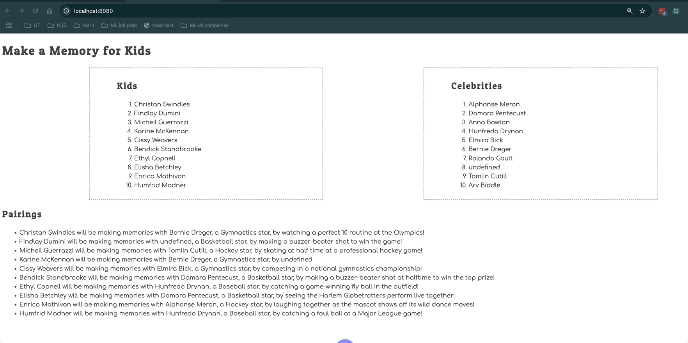

# Events and Debugging Assessment

Time to assess how well you have learned to use the debugging tools in Chrome Dev Tools, and writing click event listeners. This application is to show kids with illnesses and the memories the would like to make. Celebrities sign up to help kids make memories.

> 🧨 Make sure you answer the vocabulary and understanding questions at the end of this document before notifying your coaches that you are done with the project

## Event Listeners to Create

1. When the kid name is clicked, it should display their wish.
1. When the celebrity name is clicked, it should display their sport.
1. The pairings list should should contain the pairing in the following format.
    ```html
    {child name} will be making memories with {celebrity name}, a {celebrity sport} star, by {child wish}
    ```

Below is an animation showing how the application should look when complete and how the event listeners should work.



## Setup

Your instruction team will provide a link for you to create your assessment repository. Once your repo is created, clone it to your machine.

1. Make sure you are in your `workspace` directory.
1. `git clone {github repo SSH string}`.
1. `cd` into the directory it creates.
1. `code .` to open the project code.
1. Use the `serve` command to start the web server.
1. Open the URL provided in Chrome.

Make sure your Developer Tools are open at all times while working on this project. Use the messages provided in the Console to determine what code needs to be fixed or implemented, and use breakpoints in the Sources tab to step through your code as you debug.

## Vocabulary and Understanding

Before you click the "Complete Assessment" button on the Learning Platform, add your answers below each question and make a commit.

1. When a child is clicked on in the browser, which module contains the code that will execute on that event happening? Can you explain the algorithm of that logic?
   > When a kids' name is clicked, the event listener calls a function that renders the correlated child object from the dataset. This allows the algorithm to extract the kids wish and displays it in the UI or browser. Basically, the click even for a child/kid element is handled inside the Kidslist.js module.

2. In the **Pairings** module, why must the `findCelebrityMatch()` function be invoked inside the `for..of` loop that iterates the kids array?
   > In order for each child to be individualized. The algorithm has to locate each child and the celebrity whose celebrityId it matches, then the string is created/developed at the final pairing, with the loop ensuring each child has a celebrity. 
   
3. In the **CelebrityList** module, can you describe how the name of the sport that the celebrity plays can be displayed in the window alert text?
   > The algorithm is accessing the sport property of that celebrity object and interpolates the object(s) into the alert messsage displaying it into the UI or browser. Basically the CelebrityList module attaching each click event listener to each celebrity name. 

4. Can you describe, in detail, the algorithm that is in the `main` module?
   > The algorithm formats the UI, loads the data structures(through arrays, modules and loops)  and delegates interaction managing to the assigned modules. Further coordinating the entire application flow. 
   
   Big Picture is the main module is  the entire applications entry point and conductor for all modules to render data on the DOM. 
